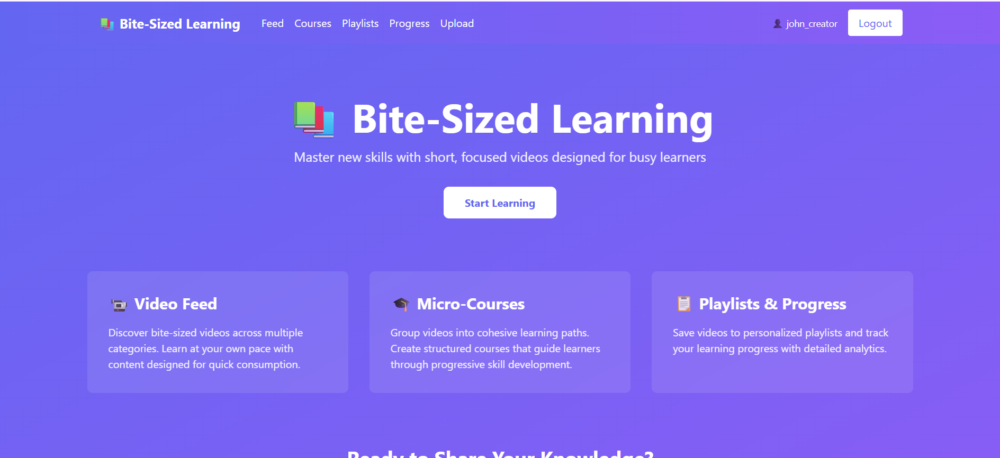
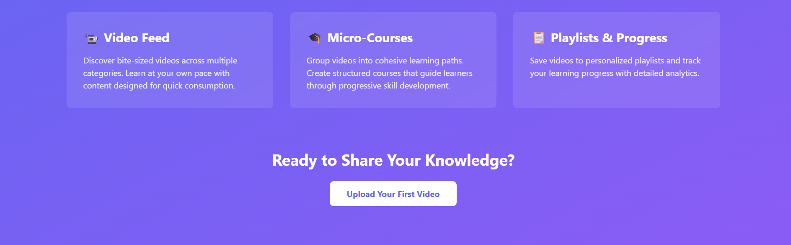
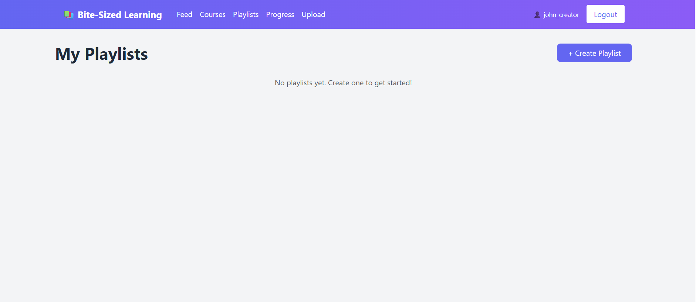
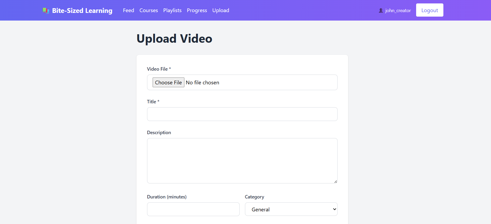
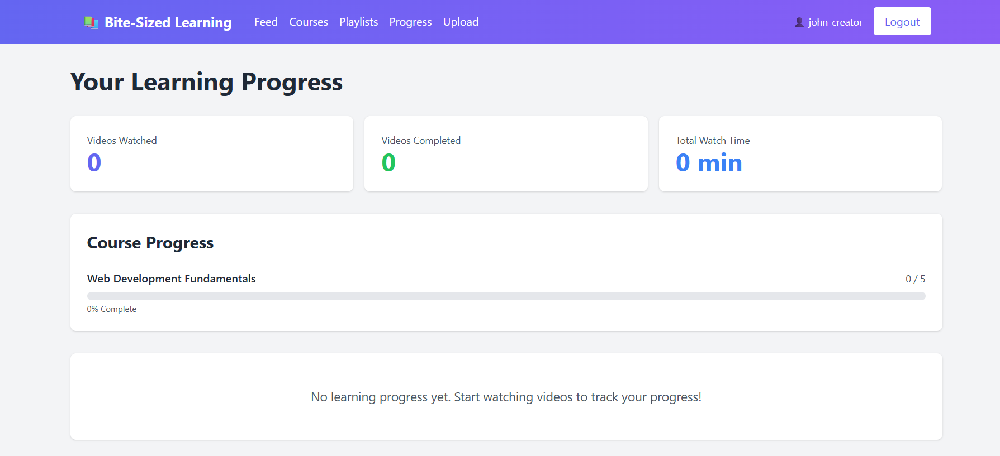
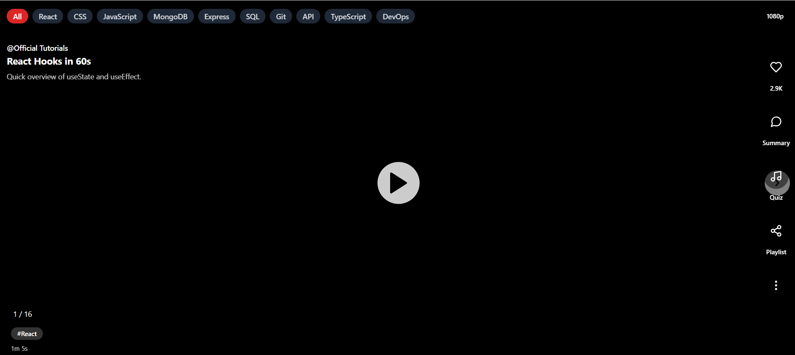

# Bite-Sized Learning MVP

A modern platform for learning micro-content through short, focused videos. Creators can upload educational videos, students can learn from structured courses and personalized playlists, and AI-powered features help generate summaries and quizzes.

## 🚀 Features

### Core Features
- **User Authentication**: Secure JWT-based authentication with role-based access (Student/Creator)
- **Video Management**: Upload, store, and browse bite-sized learning videos
- **Video Feed**: Discover videos with category filtering and sorting
- **Micro-Courses**: Group related videos into cohesive learning paths
- **Playlists**: Create personalized playlists to save favorite videos
- **Progress Tracking**: Track watched videos, completion status, and course progress
- **AI Features**: 
  - AI Summary endpoint (`/api/ai/summary`) - Generates deterministic summaries
  - AI Quiz endpoint (`/api/ai/quiz`) - Creates practice quizzes with multiple-choice questions

## 📋 Tech Stack

### Backend
- **Framework**: Node.js with Express.js
- **Database**: SQLite3 with foreign key constraints
- **Authentication**: JWT (jsonwebtoken) + bcrypt
- **File Upload**: Multer (stores files locally, configurable up to 500MB)
- **CORS**: Enabled for frontend communication

### Frontend
- **Framework**: React 18 with React Router v6
- **Styling**: Tailwind CSS
- **HTTP Client**: Axios with JWT interceptors
- **State Management**: React Context API

## 📸 App Screenshot








## 📦 Project Structure

```
bite-sized-learning/
├── backend/
│   ├── routes/              # API routes
│   │   ├── auth.js         # Authentication
│   │   ├── videos.js       # Video management
│   │   ├── courses.js      # Course management
│   │   ├── playlists.js    # Playlist management
│   │   ├── progress.js     # Progress tracking
│   │   └── ai.js           # AI features
│   ├── middleware/
│   │   └── auth.js         # JWT authentication middleware
│   ├── scripts/
│   │   └── seed.js         # Database seeding script
│   ├── uploads/            # Video file storage
│   ├── db.js               # SQLite database setup
│   ├── server.js           # Express server
│   ├── package.json
│   └── .env.example
├── frontend/
│   ├── src/
│   │   ├── pages/          # React pages
│   │   ├── components/     # Reusable components
│   │   ├── context/        # React Context
│   │   ├── api.js          # API client
│   │   ├── App.jsx         # Main app component
│   │   └── index.js        # Entry point
│   ├── public/
│   ├── package.json
│   ├── tailwind.config.js
│   └── postcss.config.js
├── database/               # SQLite database storage
└── docs/                   # Documentation and pitch deck
```

## 🛠️ Installation & Setup

### Prerequisites
- Node.js (v14 or higher)
- npm or yarn

### Backend Setup

1. **Navigate to backend directory**
   ```bash
   cd backend
   ```

2. **Install dependencies**
   ```bash
   npm install
   ```

3. **Create `.env` file** (copy from `.env.example`)
   ```bash
   cp .env.example .env
   ```
   
   Configure the `.env` file:
   ```
   PORT=5000
   JWT_SECRET=your_jwt_secret_key_here
   NODE_ENV=development
   DATABASE_PATH=../database/app.db
   ```

4. **Seed the database** (optional but recommended)
   ```bash
   npm run seed
   ```
   
   This creates:
   - 1 creator account: `john_creator` / `john@example.com` (password: `creator123`)
   - 10 sample videos across different categories
   - 1 sample course with 5 videos

5. **Start the server**
   ```bash
   npm start
   ```
   
   Development mode with auto-reload:
   ```bash
   npm run dev
   ```

The backend will run at `http://localhost:5000`

### Frontend Setup

1. **Navigate to frontend directory** (in a new terminal)
   ```bash
   cd frontend
   ```

2. **Install dependencies**
   ```bash
   npm install
   ```

3. **Start the development server**
   ```bash
   npm start
   ```

The frontend will open at `http://localhost:3000`

## 🔐 Authentication

### Register
```bash
POST /api/auth/register
Content-Type: application/json

{
  "username": "john_doe",
  "email": "john@example.com",
  "password": "securepassword",
  "role": "student" // or "creator"
}
```

### Login
```bash
POST /api/auth/login
Content-Type: application/json

{
  "email": "john@example.com",
  "password": "securepassword"
}
```

Response includes JWT token used for subsequent requests.

## 📹 API Endpoints

### Videos
- `GET /api/videos` - Get all videos (with category and pagination filters)
- `GET /api/videos/:id` - Get single video
- `GET /api/videos/creator/:creatorId` - Get videos by creator
- `POST /api/videos` - Upload new video (requires auth, multipart/form-data)

### Courses
- `GET /api/courses` - Get all courses with videos
- `GET /api/courses/:id` - Get single course
- `POST /api/courses` - Create course (creator only)
- `POST /api/courses/:courseId/videos` - Add video to course
- `DELETE /api/courses/:courseId/videos/:videoId` - Remove video from course

### Playlists
- `GET /api/playlists` - Get user's playlists (requires auth)
- `GET /api/playlists/:id` - Get single playlist
- `POST /api/playlists` - Create playlist (requires auth)
- `POST /api/playlists/:playlistId/videos` - Add video to playlist
- `DELETE /api/playlists/:playlistId/videos/:videoId` - Remove video from playlist

### Progress Tracking
- `POST /api/progress/watch` - Track video watch (requires auth)
- `GET /api/progress` - Get user's progress (requires auth)
- `GET /api/progress/course/:courseId` - Get course progress percentage

### AI Features
- `POST /api/ai/summary` - Generate video summary (deterministic, mock)
  ```json
  {
    "videoId": 1,
    "videoTitle": "React Hooks Fundamentals"
  }
  ```

- `POST /api/ai/quiz` - Generate quiz for video (deterministic, mock)
  ```json
  {
    "videoId": 1,
    "videoTitle": "React Hooks Fundamentals"
  }
  ```

## 💾 Database Schema

### Users
- id (PK)
- username (UNIQUE)
- email (UNIQUE)
- password (hashed)
- role (student/creator)
- created_at

### Videos
- id (PK)
- creator_id (FK → users)
- title
- description
- duration
- file_path
- category
- created_at

### Courses
- id (PK)
- creator_id (FK → users)
- title
- description
- created_at

### Course_Videos (Junction)
- id (PK)
- course_id (FK → courses)
- video_id (FK → videos)
- order_index

### Playlists
- id (PK)
- user_id (FK → users)
- title
- description
- created_at

### Playlist_Videos (Junction)
- id (PK)
- playlist_id (FK → playlists)
- video_id (FK → videos)
- added_at

### Progress
- id (PK)
- user_id (FK → users)
- video_id (FK → videos)
- course_id (FK → courses, nullable)
- watched_at
- watch_duration
- completed (boolean)

## 🧪 Testing

### Demo Credentials
After seeding, use these credentials to test:
- **Email**: john@example.com
- **Password**: creator123
- **Role**: Creator

### Sample Data
The seed script creates:
- 1 creator user
- 10 videos across categories: React, CSS, JavaScript, MongoDB, Express, SQL, Git, API, TypeScript, DevOps
- 1 course named "Web Development Fundamentals" with 5 videos

## 🤖 AI Endpoints (Mock Implementation)

The `/ai/summary` and `/ai/quiz` endpoints return **deterministic mock responses** based on video ID. This allows for:
- Testing AI features without external API calls
- Consistent responses for unit testing
- Easy integration when replacing with real AI service

**Example Summary Response**:
```json
{
  "videoId": 1,
  "summary": "Learn the fundamentals of React hooks and how to manage component state effectively...",
  "generatedAt": "2024-01-01T12:00:00.000Z",
  "model": "mock-ai"
}
```

**Example Quiz Response**:
```json
{
  "videoId": 1,
  "quiz": {
    "title": "Quiz for: React Hooks Fundamentals",
    "description": "Test your understanding of this video content",
    "questions": [
      {
        "id": 1,
        "question": "What hook is used to manage component state?",
        "options": ["useState", "useContext", "useEffect", "useReducer"],
        "correct": 0
      }
    ],
    "timeLimit": 30,
    "passingScore": 70
  }
}
```

## 🎨 UI Features

### Home Page
- Landing page with feature overview
- Demo account information
- Quick links to login/register

### Feed
- Video grid with category filtering
- Video cards showing title, description, creator, category, duration
- "Add to Playlist", "Summary", and "Quiz" buttons per video
- Side panel for summary/quiz display

### Courses
- Browse all available courses
- Creator can create and manage courses
- Add/remove videos from courses
- View course structure and videos

### Playlists
- Create personal playlists
- Add/remove videos from playlists
- View playlist contents

### Progress
- Overview statistics (videos watched, completed, watch time)
- Course progress with percentage completion
- Recently watched videos with completion status
- Video-level progress tracking

### Upload (Creator Only)
- Upload video files
- Add title, description, duration, category
- File size limit: 500MB

## 🚀 Deployment Considerations

### Environment Variables
- Set `NODE_ENV=production` for production
- Use a strong `JWT_SECRET` in production
- Update `REACT_APP_API_URL` for frontend if backend is on different domain

### File Storage
- Currently stores uploads in `backend/uploads/`
- For production, consider: S3, Google Cloud Storage, or Azure Blob Storage

### Database
- SQLite is fine for MVP/testing
- For production, migrate to: PostgreSQL, MySQL, or MongoDB

### CORS
- Currently allows all origins
- In production, set specific `origin` in CORS config

## 📚 Additional Resources

- [Express.js Documentation](https://expressjs.com/)
- [React Documentation](https://react.dev/)
- [Tailwind CSS Documentation](https://tailwindcss.com/)
- [SQLite Documentation](https://www.sqlite.org/docs.html)
- [JWT Best Practices](https://tools.ietf.org/html/rfc7519)

## 📝 License

This project is provided as-is for educational purposes.

## 🤝 Support

For issues or questions, please refer to the documentation or contact the development team.


